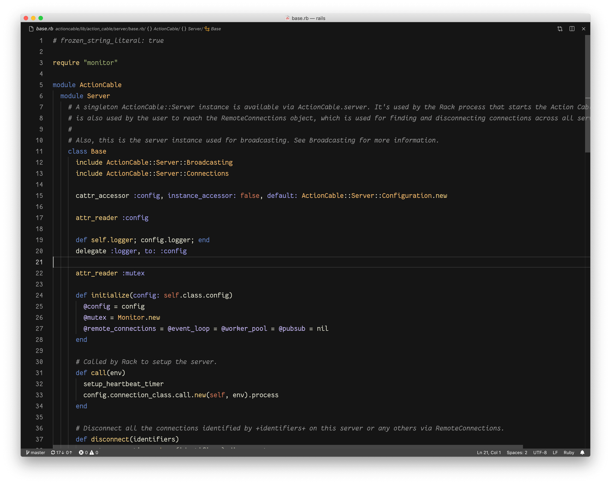

# Jellybeans color theme for vscode

Inspired by
 
- [better-jellybeans-syntax](https://github.com/zenbro/better-jellybeans-syntax)
- [Railscasts-Renewed](https://github.com/PaulOlteanu/Railscasts-Renewed)

## Screenshot

